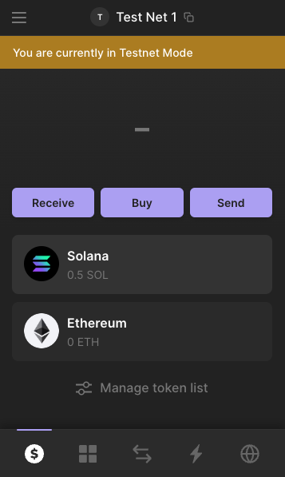
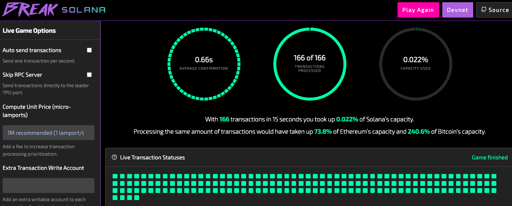

# Homework 4 

March 28th 2024

**Sending lamports**

Using the command line tool, send your colleagues some lamports. Check your balance and your colleagues balance before and after.

My input: 

```solana transfer --from testnetkeypair.json 8Mj8uPjiz7NatBYVSB9sGYGzsJ4w1Hp8xfGJroiEBgM8 0.5 --allow-unfunded-recipient --url https://api.devnet.solana.com --fee-payer testnetkeypair.json```


Output:

```Signature: XYqqpeHRPhjnuLMoGmTywPi81v9vRfsoyZxdQs9zBcCNgJchba9Usgiss56tH3DjbqDq73xRQJxy3GJ3jro3XoU```


Sure enough my secondary testnet wallet recieved 0.5 SOL



**Break Solana Game**

In your teams try the [Break Solana](https://break.solana.com/wallet?cluster=devnet) game on one of the Test networks. Post a screen shot of your team's highest score on Discord.



**Fizz Buzz Program**

1. Create a project called bootcamp using Cargo
2. The main function should print a welcome message.
3. Write a 'fizz buzz' function that will be called from your main function.
    1. The function should have a loop counting up to 301
    2. If the count is divisible by 3, print "fizz"
    3. If the count is divisible by 5 print "buzz"
4. If the count is divisible by 3 and 5 print "fizz buzz"
5. At the end print the number of times "fizz buzz" occurred.

#### My Code:

```rust
fn main() {
    println!("Welcome to FizzBuzz!");

    for i in 1..=301 {
        match (i % 3, i % 5) {
            (0, 0) => println!("FizzBuzz"),
            (0, _) => println!("Fizz"),
            (_, 0) => println!("Buzz"),
            _ => println!("{}", i),
        }
    }
}