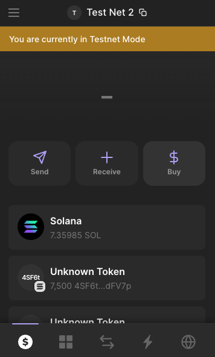
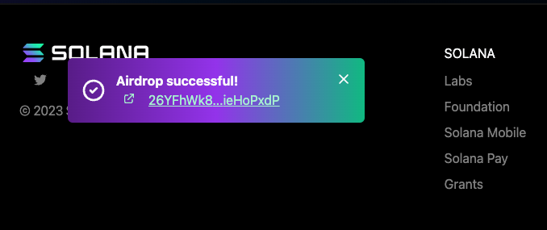
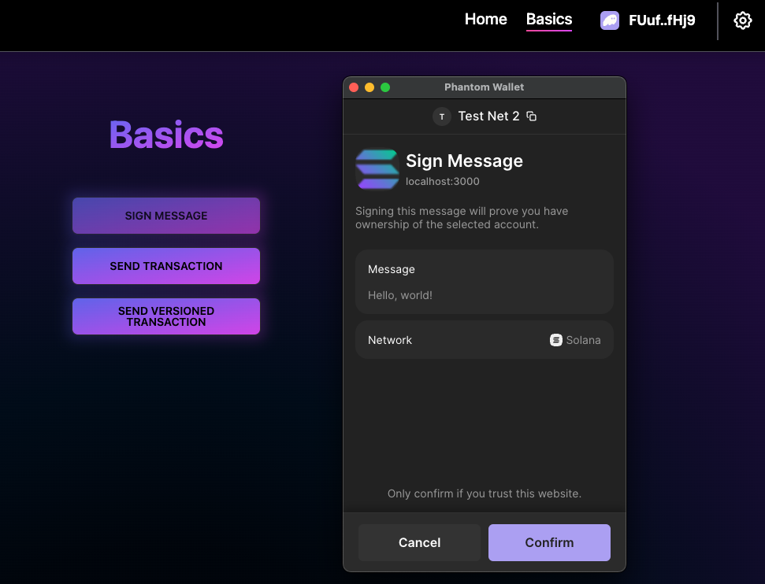
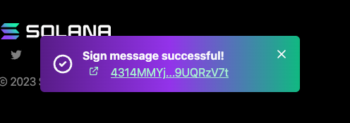
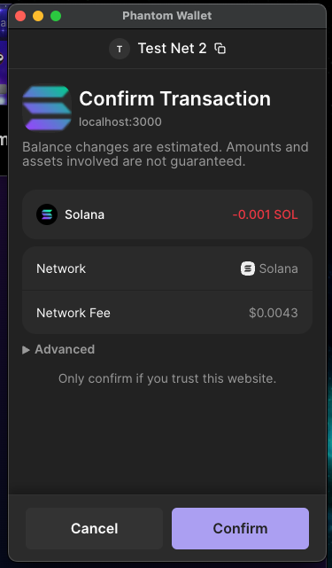
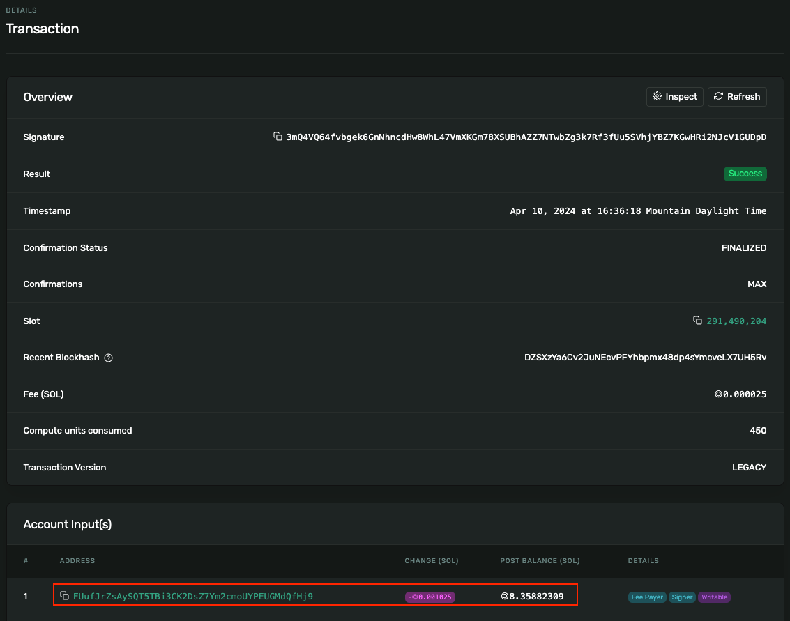

# Homework 10

#### 1. Try a simple client transaction in Solana playground [https://beta.solpg.io/](https://beta.solpg.io/)

1. Make sure you are connected to the devnet and you have a wallet set up


2. Run the default client code, this will tell you your balance.
```
Building...
Running client...
  client.ts:
    My address: FUufJrZsAySQT5TBi3CK2DsZ7Ym2cmoUYPEUGMdQfHj9
    My balance: 7.35784809 SOL


Build successful. Completed in 1.37s.
```
3. Create an airdrop signature and request the airdrop from the connection object 
pg.connection.requestAirdrop you will need to add your public key and the number of lamports you want.
```
Running client...
  client.ts:
    My address: FUufJrZsAySQT5TBi3CK2DsZ7Ym2cmoUYPEUGMdQfHj9
    My balance: 7.35784809 SOL

$ 
    Airdrop Signature: 2mEpqGLnjcCRVtPR4uZBsTKZkZvYxDF96BEuX8o7ZboEFQFekzni4fUgRch8gxrAcYSu6HaHWKEqAqxZcMHFRTnC

$ 
    Airdrop Request Response: { context: { apiVersion: '1.18.9', slot: 291236490 },
  value: 
   { confirmationStatus: 'confirmed',
     confirmations: 1,
     err: null,
     slot: 291236489,
     status: { Ok: null } } }

% solana balance

7.35884809 SOL
```
Successfully airdropped 1000000 Lamports.

Supporting Code:
```typescript
import { Connection, Account, PublicKey } from '@solana/web3.js';

// Initialize Solana connection
const connection = new Connection('https://api.devnet.solana.com');

// Replace 'YOUR_PUBLIC_KEY' with your actual public key
const publicKey = new PublicKey('FUufJrZsAySQT5TBi3CK2DsZ7Ym2cmoUYPEUGMdQfHj9');

// Generate an account object
const account = new Account();

// Define the number of lamports you want for the airdrop
const lamports = 1000000; // Change this to your desired amount

// Request airdrop
connection.requestAirdrop(publicKey, lamports).then((signature) => {
    console.log("Airdrop Signature:", signature);

    // Wait for confirmation
    connection.confirmTransaction(signature).then((result) => {
        console.log("Airdrop Request Response:", result);
    }).catch((error) => {
        console.error("Confirmation Error:", error);
    });
}).catch((error) => {
    console.error("Airdrop Request Error:", error);
});
```

4. Use await pg.connection.confirmTransaction; to
confirm the transaction.
```
Running client...
  client.ts:
    My address: FUufJrZsAySQT5TBi3CK2DsZ7Ym2cmoUYPEUGMdQfHj9
    My balance: 7.35884809 SOL

$ 
    Airdrop Signature: BeLh6jxGZEjhPcvXWeaMpMhuvJRzJwrUjUV8DxVfRCdZVa4ad1PvjCPt6i8wVJH9ifCVYv6jywWUC8K2pZazb9z

$ 
    Airdrop confirmed successfully!
```
Supporting Code:
```typescript
import { Connection, Account, PublicKey } from '@solana/web3.js';

// Initialize Solana connection
const connection = new Connection('https://api.devnet.solana.com');

// Replace 'YOUR_PUBLIC_KEY' with your actual public key
const publicKey = new PublicKey('FUufJrZsAySQT5TBi3CK2DsZ7Ym2cmoUYPEUGMdQfHj9');

// Generate an account object
const account = new Account();

// Define the number of lamports you want for the airdrop
const lamports = 1000000; // Change this to your desired amount

// Request airdrop
connection.requestAirdrop(publicKey, lamports).then(async (signature) => {
    console.log("Airdrop Signature:", signature);

    // Wait for confirmation using custom method
    try {
        await pg.connection.confirmTransaction(signature);
        console.log("Airdrop confirmed successfully!");
    } catch (error) {
        console.error("Confirmation Error:", error);
    }
}).catch((error) => {
    console.error("Airdrop Request Error:", error);
});

```

#### 2. Investigating Dapp Scaffold

Try following the functionality it provides:

1. Make sure your wallet is connected to the dev network



2. Try the airdrop to give yourself some SOL

Success!



3. Try to sign a message



Success!



Try altering the code to send a transaction to a hardcoded address such as 5xot9PVkphiX2adznghwrAuxGs2zeWisNSxMW6hU6Hkj

Within src/components/SendTransaction.tsx located the code that was generating an address to send transaction to:
```typescript
 const instructions = [
                SystemProgram.transfer({
                    fromPubkey: publicKey,
                    toPubkey: Keypair.generate().publicKey,
                    lamports: 1_000_000,
                }),
            ];
```

Removed the following code:
```typescript
toPubkey: Keypair.generate().publicKey,
```
Replaced it with:
```typescript
toPubkey: recipientPublicKeyString,
```
and added:
```typescript
const recipientPublicKeyString = '5xot9PVkphiX2adznghwrAuxGs2zeWisNSxMW6hU6Hkj';
```
Resulting in:
```typescript
const recipientPublicKeyString = '5xot9PVkphiX2adznghwrAuxGs2zeWisNSxMW6hU6Hkj';

const instructions = [
    SystemProgram.transfer({
        fromPubkey: publicKey,
        toPubkey: recipientPublicKeyString, // Use the hardcoded address here
        lamports: 1_000_000,
    }),
];
```
Send Transaction:




5. Look for the transactions on the devnet blockchain explorer.
https://explorer.solana.com/tx/3mQ4VQ64fvbgek6GnNhncdHw8WhL47VmXKGm78XSUBhAZZ7NTwbZg3k7Rf3fUu5SVhjYBZ7KGwHRi2NJcV1GUDpD?cluster=devnet

